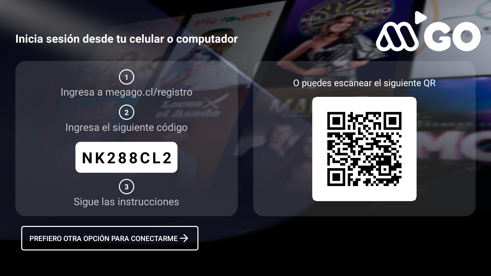

# 📺 TVtestQR – Android TV Login with QR Code

**TVtestQR** is an Android TV prototype application designed to allow users to log in securely and easily by scanning a QR code displayed on their TV screen with a mobile device.  

> **Disclaimer:** This project was developed as a **proof of concept while working at Megamedia** and does not represent or expose the production code of the official application.  

---

## 🚀 Key Features

- **QR Code Login:** Quickly sign in by scanning a unique QR code with your phone camera.  
- **Auto-Refreshing QR Code:** The code refreshes every 15 seconds to ensure security and uniqueness.  
- **Manual Login (Planned):** A fallback method allowing users to log in with email and password.  
- **Optimized Android TV UI:** Built using **Leanback** components for a clean and intuitive TV interface.  

---

## 🖼️ UI Screens (Prototype)

- Login screen with dynamic QR code.  
- Auto-refresh indication for enhanced security.  
- Planned manual login option with email/password input.

## ⚙️ How It Works

### QR Code Generation and Refresh  
- Implemented in `MainActivity.kt`.  
- A QR code and alphanumeric session code are generated and displayed on screen.  
- A `Handler` refreshes both every 15 seconds to keep the session secure.  

### Manual Login (Upcoming Feature)  
- Selecting *"Prefer another way to sign in"* will navigate to a traditional login screen.  
- Currently marked as **pending implementation** in this prototype.  

---

## 🧰 Development Details

- **Minimum SDK:** Android 21 (Lollipop)  
- **Target SDK:** Android 34  
- **Dependencies:**  
  - [ZXing](https://github.com/zxing/zxing) – QR code generation.  
  - [Glide](https://github.com/bumptech/glide) – Image handling.  
  - [Leanback](https://developer.android.com/training/tv/start/leanback) – Android TV UI framework.  

---

## 📚 References

- [Android TV Developer Guide](https://developer.android.com/tv)  
- [ZXing QR Code Library](https://github.com/zxing/zxing)  
- [Glide Image Library](https://github.com/bumptech/glide)  

---

## ✨ About this Project

This prototype was created to **showcase login flows and TV-optimized UI concepts**. It demonstrates how secure authentication using QR codes can be implemented for streaming platforms or other Android TV applications.  

The repository is public **for portfolio and demonstration purposes**. While functional, this project is not a production app and may evolve with further features and refinements.

